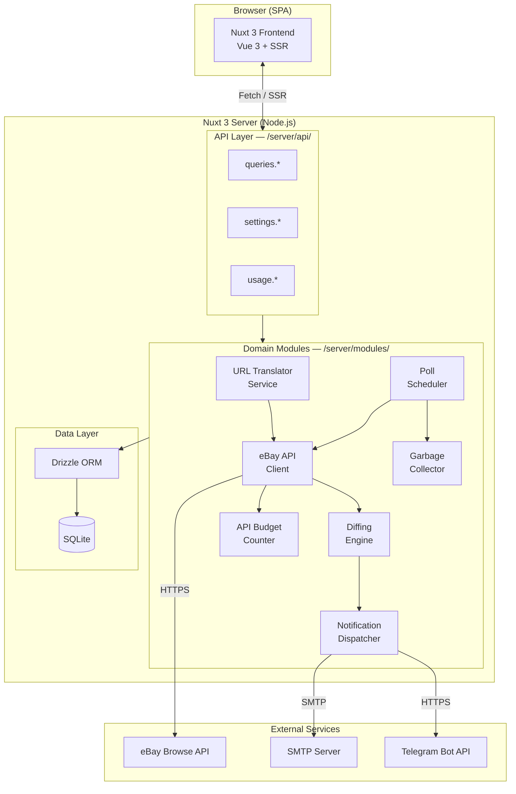
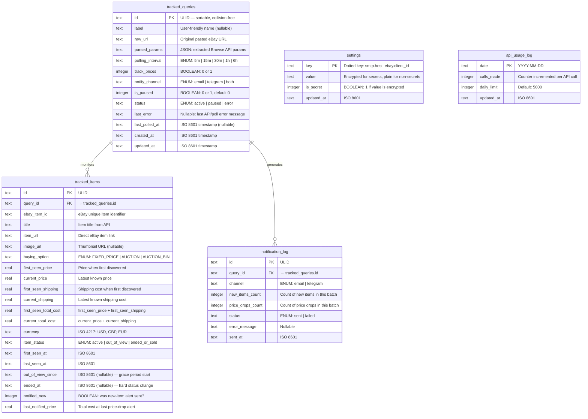
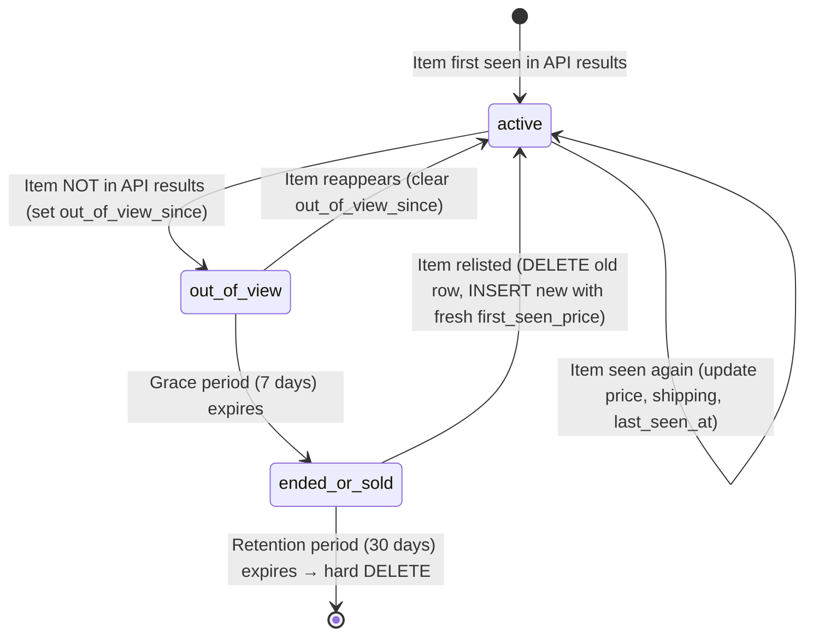
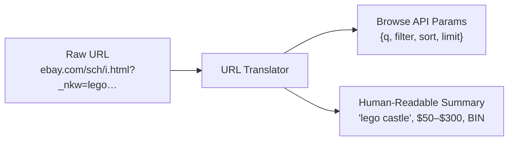
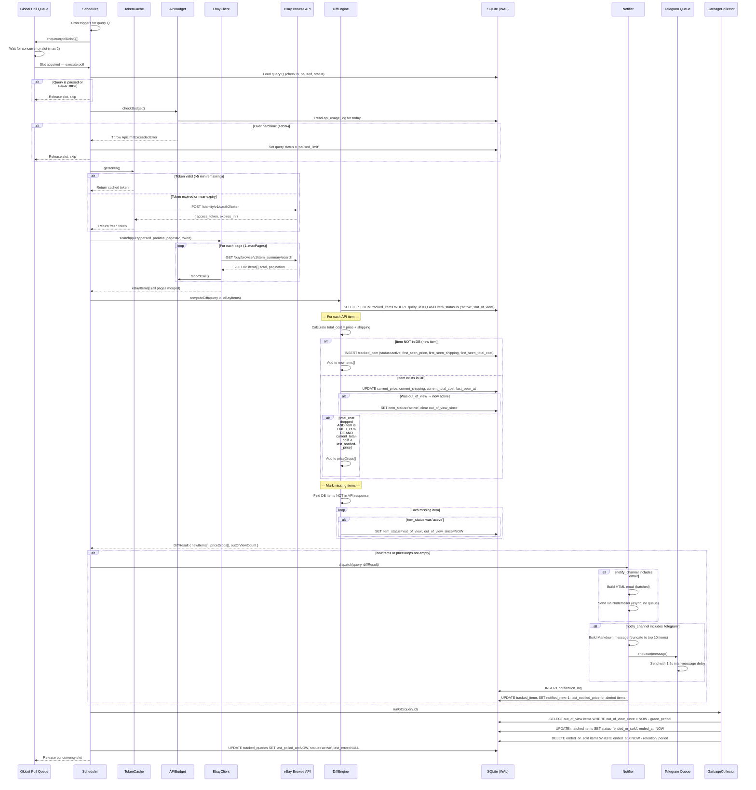

# eBay Tracker & Notifier — Technical Architecture

**Version**: 1.1  
**Date**: 2026-04-10  
**Status**: Approved  

> [!NOTE]
> **v1.1 changelog** — Added SQLite WAL mode requirement, Global Polling Queue (max concurrency 2), OAuth token lifecycle caching, Telegram flood control (1.5s inter-message delay), and resolved all open questions (marketplace dropdown, truncation strategy, price-drop threshold, ULID confirmation).  
**Companion**: [PRODUCT_SPEC.md](file:///home/nikoteressi/eBay-parser/PRODUCT_SPEC.md) v1.1  

---

## 1. High-Level Architecture

> **Architectural Style**: Modular Monolith — a single deployable unit with clearly separated internal modules communicating through in-process service calls, not HTTP. This avoids the operational complexity of microservices while maintaining clean domain boundaries.



### Module Dependency Rules

| Module | May depend on | Must NOT depend on |
|--------|---------------|-------------------|
| `URLTranslator` | — (pure function) | Any module |
| `EbayClient` | `URLTranslator`, `APIBudget`, Data Layer | `Scheduler`, `Notifier` |
| `DiffEngine` | Data Layer | `EbayClient`, `Notifier` |
| `Scheduler` | `EbayClient`, `DiffEngine`, `Notifier`, `GC`, Data Layer | `URLTranslator` |
| `Notifier` | Data Layer | `Scheduler`, `EbayClient` |
| `GC` | Data Layer | Everything else |
| `APIBudget` | Data Layer | Everything else |

> [!IMPORTANT]
> Modules communicate via direct function calls (imported services), **not** internal HTTP. This keeps the monolith lightweight while preserving testability — each module exports a clean interface that can be mocked in unit tests.

---

## 2. Technology Stack & Rationale

| Layer | Choice | Rationale |
|-------|--------|-----------|
| **Framework** | **Nuxt 3** (Vue 3, Nitro server) | Full-stack framework: Vue 3 SPA with file-based SSR, built-in API routes (`/server/api/`), and a Nitro backend — a single deployable unit that satisfies the modular-monolith constraint. No separate backend process needed. |
| **Language** | **TypeScript** (front + back) | Single language across the stack; type safety for API contracts, DB schemas, and eBay response parsing. Catches edge-case bugs at compile time. |
| **Database** | **SQLite** via `better-sqlite3` | Zero-config, file-based, embedded. Perfect for a self-hosted single-user app. No external DB process. Supports up to 100 tracked queries with sub-millisecond reads. **Must** be initialized with `PRAGMA journal_mode=WAL` and `PRAGMA busy_timeout=5000` (see §4.1). |
| **ORM** | **Drizzle ORM** | Lightweight, type-safe, SQL-close. Generates typed schemas from TS definitions. Supports SQLite natively. Migrations via `drizzle-kit`. No heavy runtime like Prisma. |
| **Scheduler** | **node-cron** + Global Polling Queue | In-process cron triggers feed into a serialized queue with concurrency limit of 2. Prevents SQLite `SQLITE_BUSY` lock storms and eBay HTTP 429 responses. See §6.2 for full design. |
| **Email** | **Nodemailer** | Industry-standard Node.js SMTP client. Supports TLS, HTML templates, and connection pooling. |
| **Telegram** | **Raw `fetch` to Bot API** | The Telegram Bot API is simple enough (one `sendMessage` endpoint) that a library is unnecessary. Keeps dependencies minimal. |
| **Encryption** | **Node.js `crypto` (AES-256-GCM)** | For encrypting API keys, SMTP passwords, and Telegram tokens at rest in SQLite. Application-level encryption with a key derived from an env var. |
| **Styling** | **Vanilla CSS** (custom properties) | Full control, no build-tool dependency for Tailwind. Dark-mode-first design system with CSS custom properties. |
| **Deployment** | **Docker** (single container) | `Dockerfile` + `docker-compose.yml`. Volume-mount for SQLite persistence. Single `docker compose up` to run. |

### Why Nuxt 3 over alternatives?

| Alternative | Why not |
|---|---|
| **Next.js (React)** | Comparable, but Vue's reactivity model is simpler for the dashboard's toggle-heavy UI. Nuxt's Nitro server is lighter than Next's Node runtime for this use case. |
| **FastAPI + Vue (separate)** | Two processes to manage (Python backend + Node frontend), violating the "single deployable" constraint. Adds Docker complexity. |
| **SvelteKit** | Viable, but smaller ecosystem for Node.js utility libraries (Nodemailer, better-sqlite3 bindings). Vue/Nuxt has a larger plugin ecosystem. |

---

## 3. Project Directory Structure

```
ebay-parser/
├── PRODUCT_SPEC.md
├── ARCHITECTURE.md
├── README.md
├── package.json
├── nuxt.config.ts
├── tsconfig.json
├── drizzle.config.ts                # Drizzle Kit migration config
├── docker-compose.yml
├── Dockerfile
├── .env.example
│
├── app/                             # Nuxt 3 app directory (frontend)
│   ├── app.vue                      # Root layout
│   ├── assets/
│   │   └── css/
│   │       ├── tokens.css           # Design tokens (colors, spacing, typography)
│   │       └── global.css           # Global styles, resets, dark mode
│   ├── components/
│   │   ├── dashboard/
│   │   │   ├── QueryTable.vue       # Main tracked-queries table
│   │   │   ├── QueryRow.vue         # Single row with inline controls
│   │   │   ├── QueryRowExpanded.vue # Expanded diff details view
│   │   │   ├── AddUrlModal.vue      # Modal for URL input + parsed preview
│   │   │   └── StatusChip.vue       # Active / Paused / Error chip
│   │   ├── settings/
│   │   │   ├── EbayApiForm.vue
│   │   │   ├── SmtpForm.vue
│   │   │   ├── TelegramForm.vue
│   │   │   └── DefaultsForm.vue
│   │   └── shared/
│   │       ├── ApiBudgetBadge.vue   # Shows daily API usage in header
│   │       └── ConfirmDialog.vue
│   ├── composables/
│   │   ├── useQueries.ts            # Query CRUD + polling state
│   │   ├── useSettings.ts           # Settings read/write
│   │   └── useApiBudget.ts          # Daily API usage counter
│   ├── layouts/
│   │   └── default.vue              # App shell with nav header
│   └── pages/
│       ├── index.vue                # Dashboard page
│       └── settings.vue             # Settings page
│
├── server/                          # Nuxt 3 server directory (backend)
│   ├── api/
│   │   ├── queries/
│   │   │   ├── index.get.ts         # GET  /api/queries
│   │   │   ├── index.post.ts        # POST /api/queries
│   │   │   ├── [id].patch.ts        # PATCH /api/queries/:id
│   │   │   ├── [id].delete.ts       # DELETE /api/queries/:id
│   │   │   └── [id]/
│   │   │       └── items.get.ts     # GET  /api/queries/:id/items
│   │   ├── settings/
│   │   │   ├── index.get.ts         # GET  /api/settings
│   │   │   ├── index.put.ts         # PUT  /api/settings
│   │   │   ├── test-smtp.post.ts    # POST /api/settings/test-smtp
│   │   │   ├── test-telegram.post.ts
│   │   │   └── test-ebay.post.ts
│   │   └── usage/
│   │       └── index.get.ts         # GET  /api/usage (daily API counter)
│   │
│   ├── modules/                     # Domain modules (business logic)
│   │   ├── url-translator/
│   │   │   ├── index.ts             # Public API: translateUrl(rawUrl) → BrowseApiParams
│   │   │   ├── param-map.ts         # URL param → Browse API param mapping table
│   │   │   └── url-translator.test.ts
│   │   ├── ebay-client/
│   │   │   ├── index.ts             # Public API: authenticate(), search()
│   │   │   ├── auth.ts              # OAuth client_credentials + token cache/refresh
│   │   │   ├── token-cache.ts       # In-memory token store with proactive refresh
│   │   │   ├── browse-api.ts        # Browse API search wrapper
│   │   │   └── ebay-client.test.ts
│   │   ├── diff-engine/
│   │   │   ├── index.ts             # Public API: computeDiff(queryId, apiItems)
│   │   │   ├── differ.ts            # Core diff logic (new, price-drop, out-of-view)
│   │   │   ├── total-cost.ts        # Price + shipping cost calculation
│   │   │   └── diff-engine.test.ts
│   │   ├── scheduler/
│   │   │   ├── index.ts             # Public API: startScheduler(), stopScheduler()
│   │   │   ├── poll-worker.ts       # Single poll cycle orchestration
│   │   │   └── cron-manager.ts      # Per-query cron job registration
│   │   ├── notifier/
│   │   │   ├── index.ts             # Public API: dispatch(queryId, diffResult)
│   │   │   ├── email-sender.ts      # Nodemailer wrapper + HTML template
│   │   │   ├── telegram-sender.ts   # Telegram Bot API wrapper + Markdown template
│   │   │   └── notifier.test.ts
│   │   ├── garbage-collector/
│   │   │   ├── index.ts             # Public API: runGC(queryId)
│   │   │   └── gc.test.ts
│   │   └── api-budget/
│   │       ├── index.ts             # Public API: checkBudget(), recordCall()
│   │       └── api-budget.test.ts
│   │
│   ├── database/
│   │   ├── schema.ts                # Drizzle schema definitions (all tables)
│   │   ├── migrations/              # Drizzle Kit generated SQL migrations
│   │   ├── index.ts                 # DB connection singleton
│   │   └── seed.ts                  # Default settings seed
│   │
│   ├── plugins/
│   │   └── scheduler.ts             # Nitro plugin: starts scheduler on server boot
│   │
│   └── utils/
│       ├── encryption.ts            # AES-256-GCM encrypt/decrypt for secrets
│       └── logger.ts                # Structured logger (pino or consola)
│
├── tests/
│   ├── unit/                        # Vitest unit tests
│   └── e2e/                         # Playwright E2E tests (optional, P2)
│
└── data/                            # Runtime data (git-ignored)
    └── ebay-tracker.db              # SQLite database file
```

> [!NOTE]
> The `server/modules/` structure enforces the modular-monolith pattern. Each module has a single `index.ts` that exports its public API. Internal files are implementation details. This makes it easy to test each module in isolation and refactor boundaries later if needed.

---

## 4. Database Schema

### 4.1 Design Decisions

> [!IMPORTANT]
> **No `SNAPSHOT` table.** The original product spec included a `SNAPSHOT` entity storing entire API response arrays as JSON blobs. This design is eliminated in favor of updating individual rows in `tracked_items` on every poll. Rationale:
> - **Storage**: A query returning 100 items polled every 5 minutes generates ~28,800 JSON snapshots/day. That's unsustainable.
> - **Diff performance**: Diffing JSON blobs requires deserialization and O(n) comparison. Row-based diffing uses indexed SQL queries.
> - **Data model fit**: The `tracked_items` table already tracks per-item state (`current_price`, `last_seen_at`, `status`). Snapshot data is inherently redundant.
>
> The `tracked_items` table IS the source of truth. Each poll updates `last_seen_at` and `current_price` on existing rows, inserts new rows, and marks missing items.

> [!CAUTION]
> **SQLite MUST be initialized with WAL mode.** The DB connection singleton (`server/database/index.ts`) must execute the following PRAGMAs immediately after opening the connection:
> ```sql
> PRAGMA journal_mode = WAL;
> PRAGMA busy_timeout = 5000;
> PRAGMA synchronous = NORMAL;
> PRAGMA foreign_keys = ON;
> ```
> **Why WAL?** Without WAL, SQLite uses a rollback journal that blocks all readers during a write. Since the poll worker writes to `tracked_items` while the API layer may be reading from it (e.g., dashboard `GET /api/queries/:id/items`), the default journal mode will throw `SQLITE_BUSY` errors. WAL (Write-Ahead Logging) allows concurrent readers during a write.
>
> **Why `busy_timeout = 5000`?** Even with WAL, only one writer can proceed at a time. If two poll workers try to write simultaneously, the second will wait up to 5 seconds before throwing `SQLITE_BUSY`. This is a safety net — the Global Polling Queue (§6.2) should prevent this scenario in practice.
>
> **Why `synchronous = NORMAL`?** With WAL mode, `NORMAL` provides a good balance between durability and write performance. Full `SYNCHRONOUS` is unnecessary for this use case (non-financial data, self-hosted).

### 4.2 Entity-Relationship Diagram



### 4.3 Table Details

#### `tracked_queries`

The central entity. Each row is one user-saved eBay search.

| Column | Type | Constraints | Notes |
|--------|------|-------------|-------|
| `id` | TEXT | PK | ULID for lexicographic sort by creation time |
| `label` | TEXT | nullable | User-defined friendly name |
| `raw_url` | TEXT | NOT NULL | Original pasted URL, kept for display and re-parsing |
| `parsed_params` | TEXT (JSON) | NOT NULL | `{ q, filter, sort, limit }` — the Browse API representation |
| `polling_interval` | TEXT | NOT NULL, CHECK | One of: `5m`, `15m`, `30m`, `1h`, `6h` |
| `track_prices` | INTEGER | NOT NULL, DEFAULT 1 | Boolean flag: track price changes? |
| `notify_channel` | TEXT | NOT NULL, DEFAULT 'both' | `email`, `telegram`, or `both` |
| `is_paused` | INTEGER | NOT NULL, DEFAULT 0 | Boolean: paused by user? |
| `status` | TEXT | NOT NULL, DEFAULT 'active' | `active`, `paused`, `error` |
| `last_error` | TEXT | nullable | Latest error message for dashboard display |
| `last_polled_at` | TEXT | nullable | ISO 8601 of last successful poll |
| `created_at` | TEXT | NOT NULL | Auto-set |
| `updated_at` | TEXT | NOT NULL | Auto-set on update |

**Indexes:**
- `idx_queries_status` on `(status)` — scheduler queries only `active` rows
- `idx_queries_next_poll` on `(is_paused, last_polled_at)` — scheduler ordering

---

#### `tracked_items`

> [!IMPORTANT]
> This is the **core table** — it replaces the `SNAPSHOT` concept entirely. Every item ever seen by the poller exists here exactly once per query. On each poll, existing rows are updated in-place (`current_price`, `current_shipping`, `current_total_cost`, `last_seen_at`). New items are inserted. Missing items transition through statuses.

| Column | Type | Constraints | Notes |
|--------|------|-------------|-------|
| `id` | TEXT | PK | ULID |
| `query_id` | TEXT | FK → `tracked_queries.id`, ON DELETE CASCADE | |
| `ebay_item_id` | TEXT | NOT NULL | eBay's item ID |
| `title` | TEXT | NOT NULL | |
| `item_url` | TEXT | NOT NULL | Direct link |
| `image_url` | TEXT | nullable | Thumbnail |
| `buying_option` | TEXT | NOT NULL | `FIXED_PRICE`, `AUCTION`, or `AUCTION_BIN` |
| `first_seen_price` | REAL | NOT NULL | Price at first discovery |
| `current_price` | REAL | NOT NULL | Updated every poll |
| `first_seen_shipping` | REAL | NOT NULL, DEFAULT 0.0 | Shipping at first discovery |
| `current_shipping` | REAL | NOT NULL, DEFAULT 0.0 | Updated every poll |
| `first_seen_total_cost` | REAL | NOT NULL | `first_seen_price + first_seen_shipping` |
| `current_total_cost` | REAL | NOT NULL | `current_price + current_shipping` |
| `currency` | TEXT | NOT NULL, DEFAULT 'USD' | |
| `item_status` | TEXT | NOT NULL, DEFAULT 'active' | `active`, `out_of_view`, `ended_or_sold` |
| `first_seen_at` | TEXT | NOT NULL | |
| `last_seen_at` | TEXT | NOT NULL | Updated every poll |
| `out_of_view_since` | TEXT | nullable | Set when item disappears; cleared if it reappears |
| `ended_at` | TEXT | nullable | Set when grace period expires |
| `notified_new` | INTEGER | NOT NULL, DEFAULT 0 | Prevents duplicate new-item alerts |
| `last_notified_price` | REAL | nullable | The `total_cost` value at the last price-drop alert sent |

**Indexes:**
- `idx_items_query_status` on `(query_id, item_status)` — diff engine queries active items per query
- `idx_items_query_ebay` on `(query_id, ebay_item_id)` UNIQUE — prevents duplicate items per query
- `idx_items_out_of_view` on `(item_status, out_of_view_since)` — GC queries for grace-period expiry
- `idx_items_ended` on `(item_status, ended_at)` — GC queries for hard-delete candidates

**Unique Constraint:**
- `(query_id, ebay_item_id)` — An eBay item can only appear once per tracked query. If a previously `ended_or_sold` item reappears (relisted), the old record is deleted and a fresh one inserted with a new `first_seen_price`.

---

#### `notification_log`

Audit trail for sent notifications. Useful for debugging delivery issues and future analytics.

| Column | Type | Constraints |
|--------|------|-------------|
| `id` | TEXT | PK (ULID) |
| `query_id` | TEXT | FK → `tracked_queries.id`, ON DELETE CASCADE |
| `channel` | TEXT | NOT NULL — `email` or `telegram` |
| `new_items_count` | INTEGER | NOT NULL, DEFAULT 0 |
| `price_drops_count` | INTEGER | NOT NULL, DEFAULT 0 |
| `status` | TEXT | NOT NULL — `sent` or `failed` |
| `error_message` | TEXT | nullable |
| `sent_at` | TEXT | NOT NULL |

**Index:**
- `idx_notif_query` on `(query_id, sent_at)` — recent notifications per query

---

#### `settings`

Key-value store for all configuration. Secrets are encrypted at rest.

| Column | Type | Constraints |
|--------|------|-------------|
| `key` | TEXT | PK |
| `value` | TEXT | NOT NULL |
| `is_secret` | INTEGER | NOT NULL, DEFAULT 0 |
| `updated_at` | TEXT | NOT NULL |

**Sample Keys:**

| Key | Sample Value | Secret? |
|-----|-------------|---------|
| `ebay.client_id` | `MyApp-PROD-abc123` | Yes |
| `ebay.client_secret` | `enc:...` | Yes |
| `ebay.marketplace` | `EBAY_US` | No | Dropdown: `EBAY_US`, `EBAY_GB`, `EBAY_DE`, `EBAY_AU`, `EBAY_FR`, `EBAY_IT`, `EBAY_ES`, `EBAY_CA` |
| `smtp.host` | `smtp.gmail.com` | No |
| `smtp.port` | `587` | No |
| `smtp.username` | `user@gmail.com` | No |
| `smtp.password` | `enc:...` | Yes |
| `smtp.use_tls` | `true` | No |
| `smtp.from` | `tracker@example.com` | No |
| `smtp.to` | `user@example.com` | No |
| `smtp.enabled` | `true` | No |
| `telegram.bot_token` | `enc:...` | Yes |
| `telegram.chat_id` | `-1001234567` | No |
| `telegram.enabled` | `true` | No |
| `defaults.polling_interval` | `15m` | No |
| `defaults.max_pages` | `2` | No |
| `defaults.retention_days` | `30` | No |
| `defaults.grace_period_days` | `7` | No |

---

#### `api_usage_log`

Daily counter for eBay API calls. One row per calendar day.

| Column | Type | Constraints |
|--------|------|-------------|
| `date` | TEXT | PK — `YYYY-MM-DD` |
| `calls_made` | INTEGER | NOT NULL, DEFAULT 0 |
| `daily_limit` | INTEGER | NOT NULL, DEFAULT 5000 |
| `updated_at` | TEXT | NOT NULL |

### 4.4 Data Lifecycle



---

## 5. Edge Case Designs

### 5.1 The "Out of View" Grace Period

> **Problem**: If an item falls off the first 2 pages of search results, it may simply have shifted in ranking — it is NOT necessarily sold. Immediately marking it `ended_or_sold` causes false-positive garbage collection.

**Solution: Two-stage disappearance.**

1. **First disappearance** → Set `item_status = 'out_of_view'` and `out_of_view_since = NOW()`. The item is excluded from new-item notifications but **still participates in diff comparisons** (if it reappears, we detect its price change).

2. **Grace period check (default: 7 days)** → The Garbage Collector runs after every poll cycle. If `out_of_view_since` is older than `grace_period_days`, the item is promoted to `ended_or_sold` and `ended_at = NOW()`.

3. **Reappearance** → If a `out_of_view` item is seen again in API results, clear `out_of_view_since` and set `item_status = 'active'`. No notification is sent (it was never truly gone).

4. **Reappearance after `ended_or_sold`** → If a `ended_or_sold` item reappears (relisted by seller), delete the old row and insert a fresh `tracked_item` with new `first_seen_price`/`first_seen_shipping`. This triggers a new-item notification.

```
Poll N:   item X present    → status = active
Poll N+1: item X absent     → status = out_of_view, out_of_view_since = NOW
Poll N+2: item X absent     → no change (still out_of_view)
…7 days later…
GC run:   grace period expired → status = ended_or_sold, ended_at = NOW
…30 days later…
GC run:   retention expired → DELETE row
```

### 5.2 Total Cost Calculation (Price + Shipping)

> **Problem**: A seller can appear to drop a price while simultaneously increasing the shipping fee. If we only compare `item_price`, we generate false price-drop alerts.

**Solution: Always diff on `total_cost = price + shipping`.**

1. **On first insert**: `first_seen_total_cost = price + shippingCost`. If the eBay API does not provide shipping data (field is absent/null), treat `shippingCost = 0` and log a warning.

2. **On every update**: `current_total_cost = current_price + current_shipping`.

3. **Price-drop detection**: The diff engine compares `current_total_cost` against `first_seen_total_cost` (base-price tracking) AND against `last_notified_price` (to avoid re-alerting on the same drop). **v1 decision: alert on ANY price drop** — no minimum threshold percentage or absolute amount. This can be revisited in v2 if users report alert fatigue.

4. **Notification display**: Show both components:
   ```
   LEGO Technic 8880 — $250.00 + $15 ship → $199.99 + $25 ship
   Total: $265.00 → $224.99 (−15.1% total cost since first seen)
   ```

5. **Free shipping edge case**: If shipping transitions from paid to free (or vice versa), the total cost still captures the change accurately.

**Diff Engine Pseudocode:**
```
totalCostDrop = first_seen_total_cost - current_total_cost
dropPercent = totalCostDrop / first_seen_total_cost * 100

if (dropPercent > 0 && current_total_cost < last_notified_price):
    → add to price_drops list
    → update last_notified_price = current_total_cost
```

### 5.3 API Limit Protection (Daily Budget Counter)

> **Problem**: eBay's Browse API allows ~5,000 calls/day for a Basic developer account. An aggressive configuration (50 queries × 2 pages × every 5 minutes) would hit 28,800 calls/day.

**Solution: A circuit breaker with soft and hard limits.**

| Threshold | Behavior |
|-----------|----------|
| **< 80% used** (< 4,000) | Normal operation |
| **80–95% used** (4,000–4,750) | **Soft limit**: Log warning. UI shows amber badge. Scheduler automatically doubles all polling intervals for the rest of the day. |
| **> 95% used** (> 4,750) | **Hard limit**: Scheduler pauses ALL polls. UI shows red badge with "API limit reached — polls paused until midnight UTC". |
| **Midnight UTC** | Counter resets to 0. Normal operation resumes. |

**Implementation:**
- The `api_usage_log` table has one row per day.
- Before every eBay API call, `APIBudget.checkBudget()` reads today's row. If over hard limit, it throws `ApiLimitExceededError` caught by the scheduler.
- After every successful API call, `APIBudget.recordCall()` increments the counter.
- The `/api/usage` endpoint returns today's `{ calls_made, daily_limit, percent_used }` for the frontend badge.

**UI Exposure:**
- A `<ApiBudgetBadge />` component in the header shows a pill: `API: 1,234 / 5,000` with color coding (green → amber → red).

### 5.4 URL Translator Service

> **Problem**: Users paste raw eBay browser URLs like `https://www.ebay.com/sch/i.html?_nkw=lego+castle&_udlo=50&LH_BIN=1&_sop=10`. The eBay Browse API uses a completely different parameter format (`q`, `filter`, `sort`).

**Solution: A dedicated, stateless translation module.**



**Module API:**
```typescript
// server/modules/url-translator/index.ts

interface TranslateResult {
  /** Params ready for Browse API search call */
  apiParams: {
    q: string;
    filter: string[];
    sort: string;
    limit: number;
  };
  /** Human-readable summary for dashboard display */
  summary: {
    keywords: string;
    minPrice?: number;
    maxPrice?: number;
    buyItNowOnly: boolean;
    sortLabel: string;
  };
}

function translateUrl(rawUrl: string): TranslateResult;
function validateUrl(rawUrl: string): { valid: boolean; error?: string };
```

**Parameter Mapping Table (from PRODUCT_SPEC):**

| eBay URL Param | Meaning | Browse API Output |
|---|---|---|
| `_nkw` | Keywords | `q = <value>` |
| `_udlo` | Min price | `filter: price:[{value}..],priceCurrency:{currency}` |
| `_udhi` | Max price | `filter: price:[..{value}],priceCurrency:{currency}` |
| `LH_BIN=1` | Buy It Now only | `filter: buyingOptions:{FIXED_PRICE}` |
| `_sop=10` | Sort: Newly Listed | `sort: newlyListed` |
| `_sop=15` | Sort: Price + Shipping (low) | `sort: price` |
| `_sop=16` | Sort: Price + Shipping (high) | `sort: -price` |

**Design Decisions:**
- The module is a **pure function** — no side effects, no DB access, no state. This makes it trivially unit-testable.
- Unknown parameters are silently ignored (logged at debug level) to avoid hard failures on future eBay URL format changes.
- The `validateUrl` function checks: (1) URL matches `ebay.com/sch/` pattern, (2) at least `_nkw` is present or the path contains a category ID.
- **Marketplace-aware**: The translator also detects the eBay domain (`.com`, `.co.uk`, `.de`) to auto-suggest the correct marketplace setting, though the user can override this in Settings.

### 5.5 OAuth Token Lifecycle (EbayClient)

> **Problem**: eBay's OAuth `client_credentials` tokens expire after **2 hours**. If `search()` is called with an expired token, the API returns `401 Unauthorized`. Naively requesting a new token before every API call wastes quota and adds latency.

**Solution: In-memory token cache with proactive refresh.**

The `EbayClient` module maintains a singleton `TokenCache` that:

1. **Stores** the current access token, its `expires_at` timestamp, and the marketplace it was issued for.
2. **On `search()` call**: checks if the cached token is valid and has **more than 5 minutes** remaining before expiry.
3. **If valid**: uses the cached token directly (zero network overhead).
4. **If expired or within 5-minute window**: calls the eBay OAuth endpoint to obtain a fresh token, stores it, then proceeds with `search()`.
5. **On 401 response** (edge case: token revoked server-side): forces a refresh regardless of the cached `expires_at`, retries the request once, then fails hard if the refresh also fails.

```
TokenCache (in-memory singleton)
├── accessToken: string
├── expiresAt: number        // Unix timestamp (ms)
├── marketplace: string      // e.g. 'EBAY_US'
│
├── getToken(): string       // returns cached or refreshes
│   ├── if (now < expiresAt - 5min) → return cached
│   └── else → call POST /identity/v1/oauth2/token
│              → store new token + expiresAt
│              → return new token
│
└── invalidate(): void       // force clear on 401
```

> [!NOTE]
> The token cache is **not** persisted to the database. On server restart, the first API call will simply request a fresh token. This is intentional — OAuth tokens are short-lived and not worth the complexity of encrypted DB storage.

### 5.6 Telegram Flood Control

> **Problem**: Telegram's Bot API enforces strict rate limits: approximately **1 message per second** to the same chat, and **30 messages per second** globally across all chats. If the scheduler completes multiple query polls in quick succession and each triggers a Telegram notification, the bot will receive HTTP 429 (`Too Many Requests`) with a `retry_after` field.

**Solution: Rate-limited dispatch queue in the Notifier module.**

1. **Inter-message delay**: The `telegram-sender.ts` module enforces a minimum **1.5-second delay** between consecutive `sendMessage` calls. This provides a safety margin above Telegram's 1 msg/sec limit.

2. **Implementation**: A simple async queue (FIFO) within the Notifier module. When `dispatch()` is called for multiple queries in the same scheduler tick, Telegram messages are enqueued and sent sequentially with `await sleep(1500)` between each.

3. **429 handling**: If Telegram responds with HTTP 429, the sender reads the `retry_after` field (in seconds) and waits that duration before retrying the message. Maximum 2 retries per message, then log as failed and move on.

4. **Independence from Email**: Email dispatch is **not** blocked by the Telegram queue. Both channels run concurrently — the Telegram queue only serializes Telegram-to-Telegram sends.

5. **Message truncation**: Telegram messages are capped at the top **10 items** (new + price drops combined). If there are more items, the message appends a footer: `"…and N more items. Check the dashboard for full details."` Messages are **never split** into multiple Telegram messages per query.

```
Notifier.dispatch(query, diffResult)
├── if (email enabled) → send email (async, no queue)
└── if (telegram enabled) → telegramQueue.enqueue(message)
                             └── processQueue()
                                  ├── send message 1
                                  ├── await sleep(1500)
                                  ├── send message 2
                                  ├── await sleep(1500)
                                  └── ...
```

---

## 6. Background Worker Flow

### 6.1 Sequence Diagram — Single Poll Cycle



### 6.2 Scheduler Design — Global Polling Queue

> [!CAUTION]
> **Why not fire all crons independently?** If 50 queries all have a 5-minute interval, they will all trigger at the same second (`:00`, `:05`, `:10`…). This causes:
> 1. **eBay HTTP 429** — 50 concurrent API calls from the same IP will trigger eBay's per-IP rate limiter.
> 2. **SQLite `SQLITE_BUSY`** — Even with WAL mode, only one writer can proceed at a time. 50 concurrent poll workers all trying to INSERT/UPDATE `tracked_items` simultaneously will queue on the write lock, degrading performance and risking `busy_timeout` expiry.
>
> The solution is a **Global Polling Queue** that serializes poll execution with a bounded concurrency.

The scheduler runs as a **Nitro server plugin** that starts when the Nuxt server boots.

```
Server Boot
  └─► scheduler.init()
       ├─► Initialize GlobalPollQueue (concurrency = 2)
       ├─► Load all tracked_queries WHERE is_paused = 0
       ├─► For each query, register a node-cron job matching polling_interval
       │    └─► Cron callback = globalQueue.enqueue(pollJob(queryId))
       └─► Watch for query CRUD events to add/remove/update cron jobs dynamically

Cron Job Fires
  └─► globalQueue.enqueue(queryId)
       └─► Queue processes jobs FIFO, max 2 concurrent:
            ├─► Acquire per-query lock (Map<queryId, boolean>)
            │    ├─► If already queued/running for this query → deduplicate (skip)
            │    └─► If slot available → execute immediately
            └─► Execute poll-worker.run(queryId)
                 ├─► Full poll cycle (see sequence diagram above)
                 └─► Release slot → next job dequeues
```

**Global Polling Queue Implementation:**

| Property | Value | Rationale |
|----------|-------|-----------|
| **Max concurrency** | `2` | Allows slight parallelism for I/O overlap (waiting on eBay API) while keeping SQLite write contention near zero. Only 1 write can proceed, but the 2nd job can be doing its API fetch while the 1st writes. |
| **Queue type** | FIFO (in-memory array) | Simple and predictable. No priority needed — all queries are equal. |
| **Deduplication** | Per-query ID | If a cron fires while the same query is already queued or running, the duplicate is silently dropped. This prevents backlog accumulation if a poll takes longer than the interval. |
| **Stagger on boot** | 2-second delay between initial enqueues | On server restart, all queries would otherwise immediately enqueue. A brief stagger prevents a thundering-herd spike at startup. |

**Concurrency protection**: The `Map<string, boolean>` per-query lock from v1.0 is retained, but now it also includes "queued" state to prevent duplicate enqueues. No distributed lock is needed (single process).

**Dynamic updates**: When a query is created, deleted, paused, or its interval changes via the API, the scheduler's in-memory cron registry is updated synchronously. If a deleted/paused query is currently in the queue, it is removed.

---

## 7. API Contracts (Summary)

> Full OpenAPI spec will be generated from the route handlers. This is a quick reference.

### Queries

| Method | Path | Body / Params | Response |
|--------|------|---------------|----------|
| `GET` | `/api/queries` | — | `Query[]` |
| `POST` | `/api/queries` | `{ raw_url, label?, polling_interval?, track_prices?, notify_channel? }` | `Query` (with parsed_params) |
| `PATCH` | `/api/queries/:id` | Partial `Query` fields | `Query` |
| `DELETE` | `/api/queries/:id` | — | `204` |
| `GET` | `/api/queries/:id/items` | `?status=active&page=1` | `{ items: TrackedItem[], total: number }` |

### Settings

| Method | Path | Body | Response |
|--------|------|------|----------|
| `GET` | `/api/settings` | — | `Setting[]` (secrets masked) |
| `PUT` | `/api/settings` | `{ key: value }` map | `Setting[]` |
| `POST` | `/api/settings/test-smtp` | — | `{ success: boolean, error?: string }` |
| `POST` | `/api/settings/test-telegram` | — | `{ success: boolean, error?: string }` |
| `POST` | `/api/settings/test-ebay` | — | `{ success: boolean, error?: string }` |

### Usage

| Method | Path | Response |
|--------|------|----------|
| `GET` | `/api/usage` | `{ date, calls_made, daily_limit, percent_used, status: 'normal' | 'warning' | 'critical' }` |

---

## 8. Security Model

| Concern | Design |
|---------|--------|
| **Secrets at rest** | All API keys, passwords, and tokens are encrypted with AES-256-GCM before storing in the `settings` table. The encryption key is derived from `ENCRYPTION_KEY` environment variable (set in `.env`). |
| **Secrets in API responses** | The `GET /api/settings` endpoint masks secret values (e.g., returns `"••••••••1234"` for the last 4 chars). Full values are never sent to the frontend. |
| **No auth (v1)** | Single-user, trusted-network assumption. The app binds to `localhost` by default. Docker exposes on `127.0.0.1` only. Clearly documented as a threat model limitation. |
| **CSRF** | Nuxt's built-in CSRF protection for server routes. |
| **SQL injection** | Drizzle ORM uses parameterized queries exclusively. No raw SQL interpolation. |
| **Dependency security** | `npm audit` in CI. Pin major versions in `package.json`. |

---

## 9. Deployment

### Docker (Primary)

```yaml
# docker-compose.yml
services:
  ebay-tracker:
    build: .
    ports:
      - "127.0.0.1:3000:3000"
    volumes:
      - ./data:/app/data           # SQLite persistence
    environment:
      - ENCRYPTION_KEY=${ENCRYPTION_KEY}
      - NODE_ENV=production
    restart: unless-stopped
```

```dockerfile
# Dockerfile
FROM node:20-alpine AS builder
WORKDIR /app
COPY package*.json ./
RUN npm ci
COPY . .
RUN npm run build

FROM node:20-alpine
WORKDIR /app
COPY --from=builder /app/.output .output
COPY --from=builder /app/package.json .
ENV NODE_ENV=production
EXPOSE 3000
CMD ["node", ".output/server/index.mjs"]
```

### Bare Metal (Alternative)

```bash
git clone <repo>
cd ebay-parser
cp .env.example .env
# Edit .env with ENCRYPTION_KEY
npm install
npm run db:migrate
npm run build
npm start    # or: node .output/server/index.mjs
```

---

## 10. Verification Plan

### Automated Tests (Vitest)

| Module | Test Focus |
|--------|-----------|
| `url-translator` | Mapping accuracy for all supported params; malformed URL rejection; unknown param tolerance |
| `diff-engine` | New item detection; price-drop with shipping cost; auction skip; `out_of_view` transition; reappearance |
| `api-budget` | Counter increment; soft-limit behavior; hard-limit blocking; midnight reset |
| `garbage-collector` | Grace-period expiry → `ended_or_sold`; retention expiry → DELETE; reappearance after ended |
| `notifier` | Batching (one email per query); HTML template rendering; Telegram markdown formatting; channel routing |

### Manual E2E Verification

1. Paste a real eBay URL → verify parsed summary is correct.
2. Wait for a poll cycle → verify `tracked_items` rows in DB.
3. Manually edit a price in DB → verify price-drop alert.
4. Remove an item from mock API → verify `out_of_view` status, then `ended_or_sold` after grace period.
5. Check API budget badge updates after each poll.
6. Verify email and Telegram messages are batched (one per query per cycle).

---

## 11. Resolved Design Decisions

> [!NOTE]
> All open questions from v1.0 have been resolved. Decisions are final for v1 implementation.

| # | Question | Decision | Rationale |
|---|----------|----------|-----------|
| 1 | **eBay Marketplace scope** | **Global dropdown in Settings**: support `EBAY_US`, `EBAY_GB`, `EBAY_DE`, `EBAY_AU`, `EBAY_FR`, `EBAY_IT`, `EBAY_ES`, `EBAY_CA`. | Users on non-US eBay sites are a significant portion of the target audience. The `ebay.marketplace` setting is already in the `settings` table. The URL Translator will auto-detect the domain but the user can override. Currency is stored per-item (`currency` column) so mixed-marketplace usage is safe. |
| 2 | **Grace period configurability** | **Global setting in Settings page**, default 7 days. | Already modeled as `defaults.grace_period_days` in the `settings` table. Exposing it in the UI is trivial (one input field in `DefaultsForm.vue`). |
| 3 | **Telegram message truncation** | **Truncate to top 10 items**, append `"…and N more items. Check the dashboard for full details."` **Never split** into multiple messages. | Splitting risks hitting flood control limits and creates a fragmented reading experience. The top-10 truncation keeps messages concise and within the 4,096-char limit. |
| 4 | **Price-drop threshold** | **Alert on ANY drop** (no minimum %). | v1 prioritizes completeness — users should see all drops. If alert fatigue becomes an issue, a configurable threshold can be added in v2. |
| 5 | **ULID vs. UUID** | **ULID** (confirmed). | Lexicographic sortability by creation time is useful for dashboard ordering without a secondary sort index. The `ulid` npm package is 0-dependency and tiny. |

---

*Document authored with guidance from the **senior-architect**, **database-architect**, and **software-architecture** skills.*
