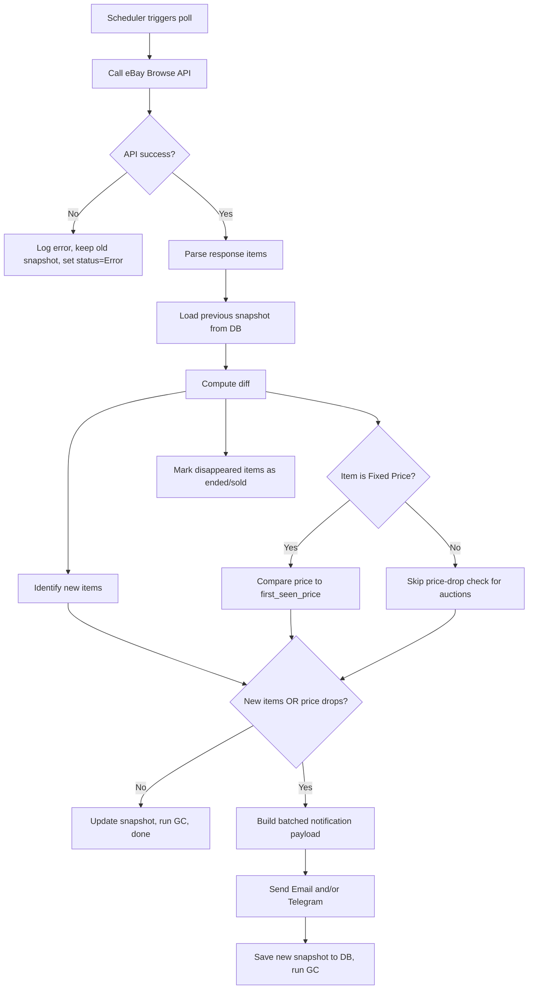
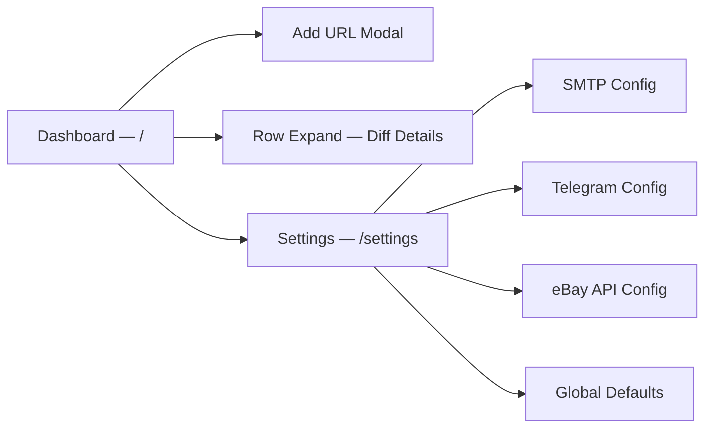
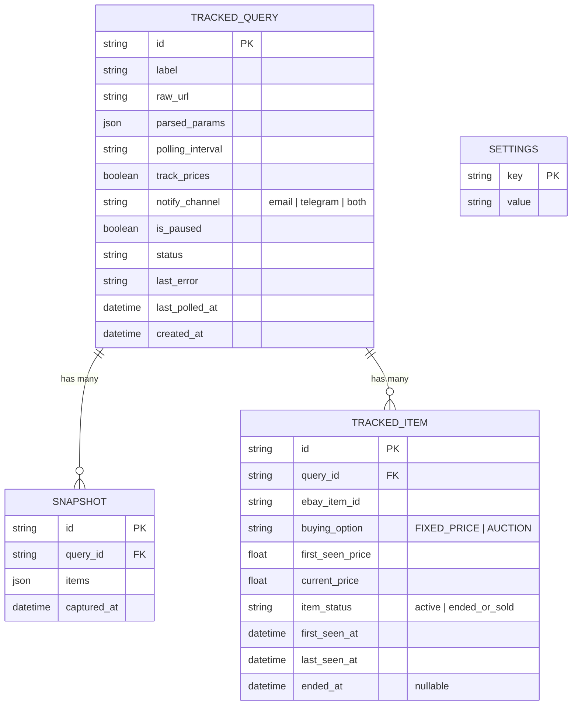

# eBay Tracker & Notifier — Product Specification

**Version**: 1.1  
**Date**: 2026-04-10  
**Status**: Draft  

> [!NOTE]
> **v1.1 changelog** — Added Telegram notifications, auction vs. BIN price-tracking rules, base-price (`first_seen_price`) tracking, and snapshot garbage collection for ended/sold items.

---

## 1. Executive Summary

### Problem Statement
eBay power-buyers and resellers currently rely on manually re-running the same search queries dozens of times a day to catch newly listed deals or price drops. There is no lightweight, self-hosted tool that turns a raw eBay search URL into a persistent, polled monitor with consolidated email alerts.

### Proposed Solution
A lightweight web dashboard where users paste raw eBay search URLs (no API knowledge required). The system continuously polls the eBay Browse API in the background, diffs results against previous snapshots, and sends **batched** email and/or Telegram notifications when new items appear or tracked items drop in price.

### Business Impact
- **Time saved** — eliminates repetitive manual searches across multiple queries.
- **Deal capture rate** — users are notified within minutes of a new listing or price change instead of discovering it hours later.
- **Zero learning curve** — paste a URL, flip a switch, done.

### Hypothesis
> We believe that **building a paste-and-track URL dashboard**  
> for **eBay deal-hunters and resellers**  
> will **reduce missed deals by >80% and save >30 min/day per user**.  
> We'll know we're right when **>50% of tracked queries result in at least one opened email alert per week**.

---

## 2. Target Users

### Primary Persona — "Deal-Hunter Dana"
| Attribute       | Detail |
|-----------------|--------|
| **Role**        | Part-time eBay reseller / hobbyist buyer |
| **Tech level**  | Comfortable browsing the web, but not writing code or configuring APIs |
| **Frequency**   | Monitors 5–20 saved search queries daily |
| **Pain today**  | Refreshes the same eBay pages 10+ times/day; misses short-lived deals |
| **Goal**        | Be the first to know when a relevant item is newly listed or drops in price |

### Secondary Persona — "Flipper Frank"
| Attribute       | Detail |
|-----------------|--------|
| **Role**        | Full-time eBay reseller |
| **Tech level**  | Can self-host apps; appreciates automation |
| **Frequency**   | Tracks 50+ queries across multiple categories |
| **Pain today**  | Existing tools are expensive SaaS platforms or overly complex |
| **Goal**        | High-volume, reliable monitoring at near-zero cost |

---

## 3. Scope

### In Scope (v1)
- Paste raw eBay search URL and auto-extract query parameters.
- Dashboard: list/table of tracked URLs with status.
- Per-URL settings: polling frequency and price-tracking toggle.
- Background polling via **eBay Browse API**.
- Diffing engine: detect new items + price changes.
- Auction-aware logic: price-drop tracking only for Fixed Price items; auctions trigger new-item alerts only.
- Base-price tracking: compare current price to `first_seen_price`, not just the previous snapshot.
- Garbage collection: mark items that disappear from results as ended/sold.
- **Batched** notifications via **Email** and/or **Telegram** (one message per query per cycle).
- Basic settings page (SMTP config, Telegram bot config, eBay API credentials).

### Out of Scope (v1)
- User authentication / multi-user support.
- Mobile-native app.
- SMS / push / webhook / Slack notifications.
- In-app bidding or purchasing actions.
- Historical price charting.
- Browser extension.
- Paid tiers or billing.
- Alerting on auction price *increases* (bid activity).

---

## 4. Feature Specifications

### 4.1 URL Input & Parsing

**Description**: Users paste a full eBay search URL from their browser. The system parses query parameters (`_nkw`, `_udlo`, `_udhi`, `_sop`, `LH_BIN`, etc.) and translates them into an eBay Browse API `search` call behind the scenes.

| ID   | Requirement | Priority | Notes |
|------|-------------|----------|-------|
| FR-01 | Accept any `ebay.com/sch/` URL and extract supported parameters | P0 | MVP-critical |
| FR-02 | Display a human-readable summary of parsed filters before saving | P0 | Confirmation UX |
| FR-03 | Validate URL format and show clear error on invalid input | P0 | — |
| FR-04 | Support at minimum: `_nkw` (keywords), `_udlo`/`_udhi` (price range), `LH_BIN` (Buy It Now), `_sop` (sort order) | P0 | Expand later |
| FR-05 | Allow user to give a friendly label/name to each tracked query | P1 | Convenience |

#### Supported URL Parameters (v1 mapping)

| eBay URL Param | Meaning | Browse API Equivalent |
|----------------|---------|----------------------|
| `_nkw`         | Keywords | `q` |
| `_udlo`        | Min price | `filter=price:[{_udlo}..],priceCurrency:USD` |
| `_udhi`        | Max price | `filter=price:[..{_udhi}],priceCurrency:USD` |
| `LH_BIN=1`     | Buy It Now only | `filter=buyingOptions:{FIXED_PRICE}` |
| `_sop`         | Sort order | `sort` mapped values |

---

### 4.2 Dashboard — Tracked Queries List

**Description**: The main view. A responsive table listing every tracked query with live status indicators.

| ID   | Requirement | Priority | Notes |
|------|-------------|----------|-------|
| FR-10 | Display table: Label, Parsed Query Summary, Polling Freq, Price Track toggle, Last Polled timestamp, Status | P0 | Core view |
| FR-11 | "Add URL" button → opens modal/panel with URL input | P0 | — |
| FR-12 | Inline toggle for "Track Price Changes" per row | P0 | — |
| FR-13 | Dropdown to change polling frequency per row | P0 | Values: 5 min, 15 min, 30 min, 1 hr, 6 hr |
| FR-14 | Delete tracked query with confirmation | P0 | — |
| FR-15 | Status chip: Active / Paused / Error | P0 | — |
| FR-16 | Pause/Resume toggle per query | P1 | — |
| FR-17 | "Results" count badge showing total items from last poll | P1 | Quick scanability |
| FR-18 | Clicking a row expands to show last diff (new items / price changes) | P2 | Nice-to-have |

---

### 4.3 Polling & Diffing Engine (Backend)

> [!CRITICAL]
> This is the core value engine. Reliability and correctness here determine whether users trust the product.

**Description**: A scheduler calls the eBay Browse API at the configured frequency for each tracked query, compares results to the previous snapshot, and identifies (a) newly-listed items and (b) price changes on previously-seen items.

| ID   | Requirement | Priority | Notes |
|------|-------------|----------|-------|
| FR-20 | Per-query scheduler respecting the user-configured polling interval | P0 | — |
| FR-21 | Fetch results from eBay Browse API `search` endpoint | P0 | — |
| FR-22 | Snapshot storage: persist item IDs + prices from each poll | P0 | — |
| FR-23 | Diff: compute set of **new item IDs** not in prior snapshot | P0 | — |
| FR-24 | Diff: compute set of **price decreases** for items present in both snapshots | P0 | Only when price-tracking is ON **and** item is Fixed Price (see FR-24a) |
| FR-24a | **Auction-aware logic**: price-drop tracking applies **only** to `FIXED_PRICE` (Buy It Now) items. For `AUCTION` items, the system alerts on new-item discovery only — never on price changes (bid fluctuations are not actionable price drops). | P0 | Hard rule |
| FR-24b | **Base-price tracking**: store `first_seen_price` when an item first appears. Price-drop calculations compare current price to `first_seen_price`, not just Snapshot N−1. Email/Telegram shows the full discount (e.g., "$100 → $80 (−20% since first seen)"). If an item's price rose then dropped, the drop is still measured from the original `first_seen_price`. | P0 | Prevents incremental-drop blindness |
| FR-25 | Mark price _increases_ in diff metadata but do NOT alert on them by default | P1 | Users care about drops |
| FR-26 | Handle eBay API rate limits gracefully (back-off, retry, queue) | P0 | — |
| FR-27 | Handle API errors without losing prior snapshot | P0 | — |
| FR-28 | Persist last-error-message on the tracked query for dashboard display | P0 | — |
| FR-29 | Support pagination: fetch up to N pages of results per query (configurable, default 2) | P1 | — |

#### 4.3.1 Garbage Collection — Ended / Sold Items

> [!IMPORTANT]
> Without garbage collection the item-tracking table grows unboundedly and stale items pollute diff results.

| ID   | Requirement | Priority | Notes |
|------|-------------|----------|-------|
| FR-50 | When an item ID present in the previous snapshot is **absent** from the current API results, mark it as `ended_or_sold` with a timestamp | P0 | Core GC rule |
| FR-51 | Items marked `ended_or_sold` are excluded from future diff comparisons | P0 | Prevents false "new item" alerts if an item is relisted with the same ID |
| FR-52 | Retain `ended_or_sold` item records for a configurable retention period (default: 30 days), then hard-delete | P1 | Keeps DB lean |
| FR-53 | If an `ended_or_sold` item **reappears** in a later poll (relisted), treat it as a brand-new item and reset `first_seen_price` | P1 | Relist = new lifecycle |
| FR-54 | Dashboard expanded-row view should show a count of recently ended/sold items alongside new/price-drop diffs | P2 | Informational |

#### Diffing Flow



---

### 4.4 Notification System — Batched Alerts (Email + Telegram)

> [!IMPORTANT]
> **One notification per query per polling cycle, per channel.** Never one message per item. This is a hard design constraint to avoid inbox/chat spam.

#### 4.4.1 Email Notifications

| ID   | Requirement | Priority | Notes |
|------|-------------|----------|-------|
| FR-30 | Batch all new items + price changes for a single query into **one email** | P0 | Anti-spam rule |
| FR-31 | Email subject: `[eBay Tracker] {queryLabel}: {N} new items, {M} price drops` | P0 | — |
| FR-32 | Email body contains a table/list per section: New Items, Price Drops | P0 | — |
| FR-33 | Each item row: Title, Price (first_seen → current for drops), Thumbnail, Direct eBay link | P0 | Uses `first_seen_price` |
| FR-34 | Configurable SMTP settings (host, port, user, pass, from/to addresses) | P0 | Settings page |
| FR-35 | "Send test email" button on settings page | P1 | — |
| FR-36 | HTML-formatted email with responsive layout | P1 | — |

#### 4.4.2 Telegram Notifications

| ID   | Requirement | Priority | Notes |
|------|-------------|----------|-------|
| FR-60 | Support Telegram Bot as a notification channel alongside (or instead of) email | P0 | — |
| FR-61 | Configurable Telegram Bot Token and Chat ID in Settings page | P0 | — |
| FR-62 | Batch all new items + price changes for a single query into **one Telegram message** | P0 | Same batching rule as email |
| FR-63 | Telegram message format: Markdown-formatted, with item title, price info, and clickable eBay link | P0 | — |
| FR-64 | Per-query notification channel selector: Email only / Telegram only / Both | P0 | Default: Both (if both configured) |
| FR-65 | "Send test message" button on Settings page for Telegram | P1 | — |
| FR-66 | Graceful handling of Telegram API failures (retry once, log error, don't block email) | P0 | Channels are independent |

#### Sample Email Structure

```
Subject: [eBay Tracker] "Vintage Lego Sets" — 3 new items, 1 price drop

─── New Items ───────────────────────────────
1. LEGO Castle 6080 King's Castle — $149.99 [Buy It Now]
   https://www.ebay.com/itm/...
2. LEGO Space 6990 Monorail — $320.00 [Buy It Now]
   https://www.ebay.com/itm/...
3. LEGO Pirates 6285 — $189.00 [Auction]
   https://www.ebay.com/itm/...

─── Price Drops (Fixed Price only) ─────────
1. LEGO Technic 8880 Super Car
   $250.00 → $199.99 (−20% since first seen)
   https://www.ebay.com/itm/...
```

#### Sample Telegram Message

```
🔔 *Vintage Lego Sets* — 3 new, 1 price drop

*New Items:*
• [LEGO Castle 6080](https://ebay.com/itm/...) — $149.99 (BIN)
• [LEGO Space 6990](https://ebay.com/itm/...) — $320.00 (BIN)
• [LEGO Pirates 6285](https://ebay.com/itm/...) — $189.00 (Auction)

*Price Drops:*
• [LEGO Technic 8880](https://ebay.com/itm/...) — ~$250→$199.99~ (−20%)
```

---

### 4.5 Settings Page

| ID   | Requirement | Priority | Notes |
|------|-------------|----------|-------|
| FR-40 | SMTP configuration form (host, port, user, pass, TLS toggle) | P0 | — |
| FR-41 | "From" and "To" email address fields | P0 | — |
| FR-42 | eBay API credentials form (App ID / Client ID, Client Secret) | P0 | OAuth client_credentials flow |
| FR-43 | Credentials stored encrypted/hashed at rest | P0 | Security baseline — applies to SMTP, eBay, **and** Telegram credentials |
| FR-44 | "Test Connection" buttons for SMTP, eBay API, **and** Telegram | P1 | — |
| FR-45 | Global default polling frequency (overridable per query) | P1 | — |
| FR-70 | Telegram Bot Token field | P0 | Obtained from @BotFather |
| FR-71 | Telegram Chat ID field (supports private chat or group ID) | P0 | — |
| FR-72 | Toggle to enable/disable each notification channel globally | P0 | Users may want only one channel |
| FR-73 | Ended/sold item retention period setting (default: 30 days) | P1 | Controls GC behavior |

---

## 5. Non-Functional Requirements

| Category | Requirement | Target |
|----------|-------------|--------|
| **Performance** | Dashboard page load | < 500 ms |
| **Performance** | Single API poll + diff cycle | < 10 s |
| **Reliability** | App uptime (self-hosted) | Design for 99%+ without manual intervention |
| **Reliability** | No silent data loss on crash | Snapshots persisted to durable storage |
| **Security** | API keys / SMTP password | Encrypted at rest |
| **Security** | No auth in v1; assume single-user, local/trusted network | Document threat model |
| **Scalability** | Support up to 100 tracked queries | v1 ceiling |
| **Scalability** | eBay API: stay within Browse API rate limits | Respect `X-RateLimit-*` headers |
| **Usability** | Zero-config startup | `npm start` or `docker compose up` |

---

## 6. UI Design & Layout

### 6.1 Design Principles
1. **Zero-learning-curve** — every action should be obvious without a tutorial.
2. **Information density** — show the most critical info in the table; details on demand.
3. **No visual clutter** — dark mode by default, modern design, generous whitespace.

### 6.2 Page Map



### 6.3 Dashboard Wireframe (ASCII)

```
┌──────────────────────────────────────────────────────────────────────┐
│  eBay Tracker & Notifier                        [⚙ Settings]       │
├──────────────────────────────────────────────────────────────────────┤
│                                                                      │
│  [ + Add URL ]                                                       │
│                                                                      │
│  ┌────────┬─────────────────────┬──────────┬────────┬──────┬──────┐ │
│  │ Label  │ Query Summary       │ Interval │ Price  │ Last │Status│ │
│  │        │                     │          │ Track  │ Poll │      │ │
│  ├────────┼─────────────────────┼──────────┼────────┼──────┼──────┤ │
│  │ Vintage│ "lego castle"       │ [15 min▾]│ [ON ]  │ 2m   │ 🟢  │ │
│  │ Lego   │ $50–$300, BIN only  │          │        │ ago  │      │ │
│  ├────────┼─────────────────────┼──────────┼────────┼──────┼──────┤ │
│  │ Camera │ "sony a7iii"        │ [ 1 hr▾] │ [OFF]  │ 23m  │ 🟢  │ │
│  │ Deals  │ <$1500              │          │        │ ago  │      │ │
│  ├────────┼─────────────────────┼──────────┼────────┼──────┼──────┤ │
│  │ Vinyl  │ "beatles vinyl"     │ [ 5 min▾]│ [ON ]  │ —    │ 🔴  │ │
│  │ Records│ No filters          │          │        │      │Error │ │
│  └────────┴─────────────────────┴──────────┴────────┴──────┴──────┘ │
│                                                                      │
└──────────────────────────────────────────────────────────────────────┘
```

### 6.4 Add URL Modal Wireframe

```
┌─────────────────────────────────────────────────┐
│  Add Tracked Search                         [×] │
├─────────────────────────────────────────────────┤
│                                                 │
│  Label (optional):                              │
│  ┌─────────────────────────────────────────┐    │
│  │ My Vintage Lego Search                  │    │
│  └─────────────────────────────────────────┘    │
│                                                 │
│  Paste eBay search URL:                         │
│  ┌─────────────────────────────────────────┐    │
│  │ https://www.ebay.com/sch/i.html?_nk...  │    │
│  └─────────────────────────────────────────┘    │
│                                                 │
│  ── Parsed Filters (auto-populated) ──────────  │
│  Keywords: "lego castle"                        │
│  Price: $50 – $300                              │
│  Buy It Now: Yes                                │
│  Sort: Newly Listed                             │
│                                                 │
│  Polling Interval:  [15 min ▾]                  │
│  Track price changes: [ON]                      │
│                                                 │
│  [ Cancel ]                    [ Start Tracking ]│
└─────────────────────────────────────────────────┘
```

### 6.5 Settings Page Wireframe

```
┌──────────────────────────────────────────────────────────────────┐
│  ← Dashboard          Settings                                  │
├──────────────────────────────────────────────────────────────────┤
│                                                                  │
│  ── eBay API ──────────────────────────────────────────────────  │
│  App ID (Client ID):   [________________________]               │
│  Client Secret:        [________________________]               │
│  Marketplace:          [EBAY_US ▾]                              │
│  [ Test Connection ]   ✅ Connected                              │
│                                                                  │
│  ── Email (SMTP) ────────────────────────── Enabled [ON] ─────  │
│  SMTP Host:            [________________________]               │
│  SMTP Port:            [587]                                    │
│  Username:             [________________________]               │
│  Password:             [________________________]               │
│  Use TLS:              [ON]                                     │
│  From Address:         [________________________]               │
│  To Address:           [________________________]               │
│  [ Send Test Email ]   ✅ Sent successfully                      │
│                                                                  │
│  ── Telegram ────────────────────────────── Enabled [ON] ─────  │
│  Bot Token:            [________________________]               │
│  Chat ID:              [________________________]               │
│  [ Send Test Message ] ✅ Sent successfully                      │
│                                                                  │
│  ── Defaults ─────────────────────────────────────────────────  │
│  Default Polling Interval:  [15 min ▾]                          │
│  Max API pages per query:   [2]                                 │
│  Ended/sold retention:      [30 days ▾]                         │
│                                                                  │
│                                   [ Save Settings ]              │
└──────────────────────────────────────────────────────────────────┘
```

---

## 7. MoSCoW Prioritization Summary

### Must Have (P0 — Launch blockers)
- Paste & parse eBay URL → extract query.
- Dashboard table with add/delete.
- Per-query polling frequency selector.
- Per-query price-tracking toggle (applies to Fixed Price items only).
- Background scheduler + eBay Browse API integration.
- Snapshot diffing: new items + price drops (using `first_seen_price` baseline).
- Auction-aware logic: new-item alerts only for auctions, no price-drop tracking.
- Garbage collection: mark disappeared items as ended/sold.
- **Batched** email notification (one email per query per cycle).
- **Batched** Telegram notification (one message per query per cycle).
- SMTP, Telegram, & eBay API credential configuration.
- Per-channel enable/disable toggle.
- Graceful API error handling.

### Should Have (P1 — Important, not blocking)
- Friendly labels for queries.
- Pause/Resume per query.
- "Test Connection" buttons (SMTP, Telegram, eBay API).
- Result-count badge.
- HTML-formatted email.
- Global default polling interval.
- API pagination support (multi-page results).
- Configurable ended/sold item retention period.
- Relisted-item detection (reset `first_seen_price`).

### Could Have (P2 — Nice to have)
- Expand row to show last diff inline (including ended/sold count).
- Dark / light theme toggle.
- Desktop browser notifications (in addition to email/Telegram).
- Export tracked queries as JSON backup.

### Won't Have (v1)
- Multi-user auth.
- SMS/push/Slack/webhook notifications.
- Price history charts or graphs.
- In-app eBay purchasing.
- Mobile-native app.
- Browser extension.
- Alerting on auction bid-price changes.

---

## 8. Risks & Mitigations

| # | Risk | Probability | Impact | Mitigation |
|---|------|-------------|--------|------------|
| 1 | **eBay API rate-limiting** — aggressive polling hits limits | High | High | Implement back-off; queue polls; respect `X-RateLimit-*` headers; warn user when interval is too aggressive for their number of queries |
| 2 | **API credential complexity** — users struggle to obtain eBay API keys | Medium | High | Provide step-by-step guide in Settings page; link to eBay Developer portal |
| 3 | **URL format changes** — eBay modifies search URL structure | Low | Medium | Abstract parser behind versioned module; monitor for breakage |
| 4 | **Email deliverability** — alerts land in spam | Medium | Medium | Recommend Gmail App Passwords or a transactional email service; provide SPF/DKIM guidance |
| 5 | **Scope creep** — feature requests for charts, push, multi-user | High | Medium | Strict MoSCoW; park in backlog; only revisit after v1 metrics reviewed |
| 6 | **Telegram Bot API changes or rate limits** — message delivery fails | Low | Medium | Retry once; fall back to email; log failure for dashboard display |
| 7 | **Database growth from item tracking** — `first_seen_price` records accumulate | Medium | Low | GC policy auto-deletes ended/sold items after retention period; configurable in Settings |
| 8 | **Auction vs. BIN misclassification** — API returns ambiguous `buyingOptions` | Low | Medium | Default to treating item as Fixed Price if `buyingOptions` is absent; log ambiguous cases |

---

## 9. Success Metrics

| Metric | Definition | Target (v1, 90 days post-launch) |
|--------|-----------|----------------------------------|
| **Queries tracked** | Total active tracked queries per user | ≥ 10 |
| **Alert open rate** | % of sent emails opened | > 40% |
| **Deal capture latency** | Time from item listing to alert received | < 2× polling interval |
| **System uptime** | % time the scheduler is running without manual restart | > 99% |
| **User error rate** | % of paste-URL attempts that result in a parse error | < 5% |

---

## 10. Technical Architecture Overview (High-Level Only)

> [!NOTE]
> This section describes architecture **constraints** and **boundaries**, not implementation. Detailed technical design will follow in a separate `TECHNICAL_SPEC.md`.

### Suggested Stack
- **Frontend**: Single-page app (HTML/CSS/JS or React/Vue).
- **Backend**: Node.js or Python (lightweight, fast to develop).
- **Database**: SQLite (self-hosted simplicity) or PostgreSQL.
- **Scheduler**: Node `setInterval` / cron / `node-cron` / Celery beat — whatever fits the backend choice.
- **Email**: Nodemailer / Python `smtplib`.
- **Telegram**: `node-telegram-bot-api` / Python `python-telegram-bot` or raw HTTP to Bot API.

### Key Data Entities



### API Boundary: eBay Browse API

- **Endpoint**: `GET /buy/browse/v1/item_summary/search`
- **Auth**: OAuth 2.0 client_credentials (Application access token)
- **Key params**: `q`, `filter`, `sort`, `limit`, `offset`
- **Rate limits**: Varies by eBay tier; **must** be respected.

---

## 11. Milestones & Timeline

| Milestone | Target | Deliverables | Exit Criteria |
|-----------|--------|--------------|---------------|
| **M0 — Product Spec** | Week 0 | This document | Approved by stakeholder |
| **M1 — Technical Design** | Week 1 | `TECHNICAL_SPEC.md`, DB schema, API contracts | Review complete |
| **M2 — Core Backend** | Week 2–3 | URL parser, eBay API client, diffing engine, scheduler | Unit tests pass; manual poll returns correct diff |
| **M3 — Notifications** | Week 3–4 | SMTP integration, Telegram bot integration, email + Telegram templates, batching logic | Test email and Telegram message send correctly with batched items |
| **M4 — Web Dashboard** | Week 4–5 | Dashboard UI, Add URL modal, Settings page | All FR P0 items functional in browser |
| **M5 — Integration & Polish** | Week 5–6 | End-to-end flow, error handling, edge cases | Full scenario: paste URL → wait → receive correct alert |
| **M6 — Documentation & Launch** | Week 6 | README, setup guide, Docker support | New user can `docker compose up` and be tracking in 5 min |

---

## 12. Open Questions

> [!IMPORTANT]
> These must be resolved before or during M1 (Technical Design).

1. **eBay API tier**: Which eBay Developer Program tier will we target (Basic / self-service)? This affects rate limits and available endpoints.
2. **Multi-marketplace**: Should v1 support non-US eBay sites (`ebay.co.uk`, `ebay.de`), or US-only?
3. **Snapshot retention**: How long should old snapshots be kept? On-disk cost vs. future analytics value.
4. **Deployment model**: Docker-first? Bare `npm start`? Both?
5. **Currency handling**: If supporting multiple marketplaces, how to handle currency in price-drop calculations?
6. **Telegram message length**: Telegram messages have a 4096-char limit. For queries with many results, should we truncate and add a "…and N more" footer, or split into multiple messages?
7. **First-seen-price edge case**: If eBay returns a multi-variant listing where the price differs by variant, should `first_seen_price` track the lowest variant price or the displayed price?

---

## Appendix A — Concise Action Plan

> Derived using the **concise-planning** framework.

### Approach
Build a self-hosted, single-user web dashboard that converts pasted eBay search URLs into scheduled API polls, diffs results, and sends batched alerts via email and Telegram. Price tracking uses `first_seen_price` baselines and applies only to Fixed Price items. A GC process keeps the database lean by retiring ended/sold items. Start with backend engine, then layer on the UI.

### Scope
- **In**: URL parsing, Browse API polling, snapshot diffing, auction-aware logic, base-price tracking, GC for ended items, batched email + Telegram, web dashboard, settings page.
- **Out**: Auth, multi-user, push/SMS/Slack, price charts, mobile app, browser extension.

### Action Items

- [ ] Finalize and approve this `PRODUCT_SPEC.md`.
- [ ] Write `TECHNICAL_SPEC.md` (DB schema incl. `TRACKED_ITEM` entity, API contracts, tech stack decision).
- [ ] Build eBay URL parser module with unit tests.
- [ ] Build eBay Browse API client (auth + search) with unit tests.
- [ ] Build snapshot storage layer, `first_seen_price` tracking, and diffing engine.
- [ ] Implement auction-aware logic: skip price-drop checks for `AUCTION` items.
- [ ] Implement GC: mark disappeared items as `ended_or_sold`, auto-purge after retention period.
- [ ] Build scheduler (per-query intervals, pause/resume).
- [ ] Build email notification module (batching, templates, SMTP).
- [ ] Build Telegram notification module (batching, Markdown formatting, Bot API).
- [ ] Build web dashboard (tracked-queries table, add/delete, inline controls).
- [ ] Build settings page (SMTP + Telegram + eBay API credentials).
- [ ] End-to-end integration test: paste → poll → diff → email + Telegram.
- [ ] Write README and Docker setup.
- [ ] Launch v1 and collect feedback.

### Validation
- [ ] Unit tests cover URL parser, differ, email batcher, and Telegram formatter.
- [ ] Manual E2E: paste a real eBay URL, wait for poll cycle, verify email and Telegram content.
- [ ] Verify batching: artificially inject multiple new items; confirm single email and single Telegram message.
- [ ] Verify auction logic: inject an auction item with price change; confirm NO price-drop alert.
- [ ] Verify base-price: simulate incremental drops ($100→$90→$80); confirm alert shows "$100 → $80 (−20%)".
- [ ] Verify GC: remove items from mock API response; confirm they get marked `ended_or_sold`.

---

*Document authored with guidance from the **product-manager-toolkit** (Standard PRD + MoSCoW + Hypothesis Template) and **concise-planning** (Approach/Scope/Action Items) skills.*
